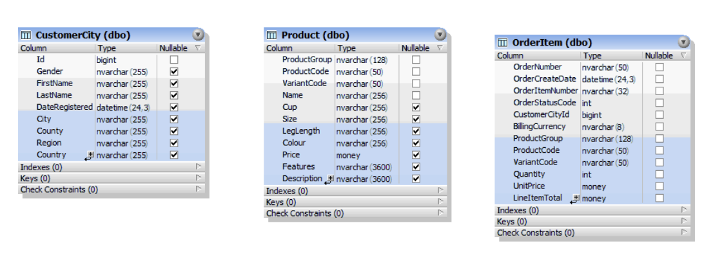

# Database optimisation in SQL
The aim of this project is to carry out a review of the given SQL Server database tables supporting an online sales application (of a brand for mothers-to-be and mothers of babies and pre-school children) and implement improvements.

## Given tables
There are 3 existing tables as shown below:   
   

## Overview of tasks
- All three tables normalised to 3NF
- Existing data migrated to the new data structure
- Primary and foreign keys are defined in the resulting (normalised) database schema to safeguard the data integrity of the database
- There is a business requirement that an Order Group entity/relation is introduced in the database schema with the following attributes and relationships:
  - i) OrderNumber: A string attribute that contains the order number. Observe that this is an existing attribute in the OrderItem table in the database schema. An order number has the format OR\DDMMYYYY\NN, where NN is a sequential number from 01 to 99, for example OR\01012006\04.
  - ii) OrderStatusCode: A string attribute that contains the status code of the order. Observe that this is an existing attribute in the OrderItem table in the database schema. The OrderStatusCode attribute contains the following order status codes: 
0: This is a new order 
1: This an abandoned order 
2: This is an unfulfilled order due to out of stock item(s) 
3: This is an order that have been cancelled by the customer 
4: This is a fulfilled order; the goods have been shipped to the customer
  - iii) OrderCreateDate: The order creation date. Observe that this is an existing attribute in the database schema.
  - iv) BillingCurrency: The billing currency of the order. Observe that this is an existing attribute in the database schema.
  - v) TotalLineItems: The total number of items ordered. Observe that this is a new attribute in the database schema.
  - vi) SavedTotal: The total order value. Observe that this is a new attribute in the database schema.
  - vii) The Order Group entity may contain zero or more order items.
- Transaction Processing: new stored procedures to deliver order processing functionality for the new Order Group Entity
  - Developed the stored procedure **prCreateOrderGroup**.  The execution of this program will create a new order based on the parameter values supplied below: 
    - OrderNumber: nvarchar(32)
    - OrderCreateDate: datetime
    - CustomerCityId: int
  - Developed the stored procedure **prCreateOrderItem**. The execution of this program will create a new order line based on the parameter values supplied below: 
    - OrderNumber nvarchar(32)
    - OrderItemNumber nvarchar(32)
    - ProductGroup nvarchar(128)
    - ProductCode nvarchar(255)
    - VariantCode nvarchar(255)
    - Quantity int
    - UnitPrice money
- Error handling done for stored procedures to ensure that the data consistency is maintained during successful and unsuccessful program execution
- Implemented indexes to improve order processing performance

## Acknowledgements
Project team:
[Steryios Nicolaides](https://www.linkedin.com/in/steryios-nicolaides-7a02511b0/) • [Jamie Prestwich](https://www.linkedin.com/in/james-prestwich/) • [Pauline Schouten](https://www.linkedin.com/in/pauline-schouten-b77208235/) • [Rudra Someshwar](https://www.linkedin.com/in/itsrudra/)
